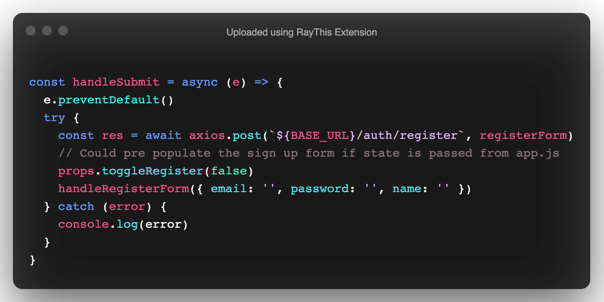
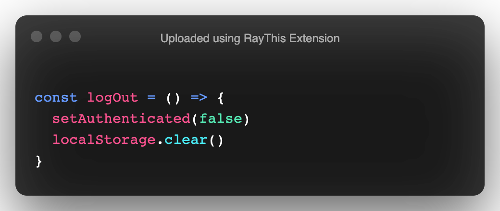
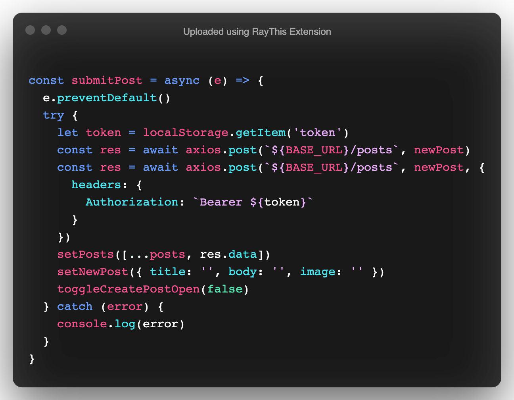

# React Authentication


## Overview

In this lesson, we'll learn to to integrate authentication into our react client. We'll learn how to persist an authenticated user in our application and how to protect resources from unauthenticated users. This app was build with Semantic UI but we'll be focusing on only integrating the `axios` calls.

## Getting Started

- Fork and Clone
- `npm install`
- `npm run dev`
- `cd client`
- `npm install`
- `npm start`

## Understanding The LocalStorage API

In order to persist a users token, we'll need to use something called `localStorage`. `localStorage` is an in browser memory store.

### What Is LocalStorage

> localStorage is a property that allows JavaScript sites and apps to save key/value pairs in a web browser with no expiration date. This means the data stored in the browser will persist even after the browser window is closed.

### How Does LocalStorage Work?

To use localStorage in your web applications, there are five methods to choose from:

1. `setItem()`: Add key and value to localStorage
2. `getItem()`: This is how you get items from localStorage
3. `removeItem()`: Remove an item by key from localStorage
4. `clear()`: Clear all localStorage
5. `key()`: Passed a number to retrieve the key of a localStorage

## Setting Up Our Authenticated State

Frontends are not typically the secured portion of our applications. Our resources should be protected by the backend. Our front end will only control what is viewed! To do this, we'll use an `authenticated` state set to `false` initially. The state variables have already been set up for you:

```js
const [authenticated, setAuthenticated] = useState(false)
```

This boolean will control the view for when a user is successfully authenticated.

## Building Login Functionality

Find `components/Login.js`. In here we'll set up an `axios` call to make a `login` request to our backend.
Find the `handleSubmit` method which has been provided for you:

```js
const handleSubmit = async (e) => {
  e.preventDefault()
  try {
    //  All Code Goes Here
  } catch (error) {
    console.log(error)
  }
}
```

In order for this function to work, we'll need to do a few things:

- Perform a `POST` request to `/auth/login` and provide the `Login` form data for the request body
  ```js
  const res = await axios.post(`${BASE_URL}/auth/login`, loginForm)
  ```
- Set the returned token to `localstorage`
  ```js
  localStorage.setItem('token', res.data.token)
  ```
- Toggle our `authenticated` state to true
  ```js
  props.toggleAuthenticated(true)
  ```
- Close the login modal
  ```js
  props.toggleLogin(false)
  ```
- Clear the login form
  ```js
  handleLoginForm({ email: '', password: '' })
  ```

Final `handleSubmit`:


## Testing Login Functionality

At this point, you should now be able to log in to our application. Utilizing the credentials you created in the `Sequelize Auth` lesson, perform a log in request.

You'll notice that the view for the posts has changed.

## Building Register Functionality

Find `components/Register`. In this component find the `handleSubmit` function.

```js
const handleSubmit = async (e) => {
  e.preventDefault()
  try {
    // Code goes here
  } catch (error) {
    console.log(error)
  }
}
```

- We'll use `axios` make a `POST` request to our backend to register a new user and provide the `registerForm` as the request body
  ```js
  const res = await axios.post(`${BASE_URL}/auth/register`, registerForm)
  ```
- We close the register model
  ```js
  props.toggleRegister(false)
  ```
- We finally clear the form
  ```js
  handleRegisterForm({ email: '', password: '', name: '' })
  ```

Final `handleSubmit`:



## Testing Registration

Click on the `Register` button in the application. Let's try to create a new user.

If everyting was done correct, the modal should close and you should see a status `200` in your server logs.

## Persisting Users

Let's log in to our application one more time. If you refresh the page however, you'll notice that we're signed out again. This is because we have not told our React app to check for an existing token.

Find `src/App.js`. We'll start by creating a function called `getToken`. This function is going to check if a token exists in `localStorage`. If the token exists, we toggle our `authenticated` state.

```js
const getToken = () => {
  let token = localStorage.getItem('token')
  if (token) {
    return setAuthenticated(true)
  }
}
```

Finally, we want this function to fire once the component loads. Add `getToken` to the provided `useEffect`:

```js
useEffect(() => {
  getToken()
  getPosts()
}, [])
```

Now refresh your application, you should be automatically logged in!

## Building Log Out

Next we'll finalize our `login/logout` functionality.

In `src/App.js`, a `logOut` function has been provided.

- Set our `authenticated` state to `false`
  ```js
  setAuthenticated(false)
  ```
- Clear the token from `localstorage`
  ```js
  localStorage.clear()
  ```
  Final `logOut` function:
  

## Testing Log Out

Let's test the log out functionality. Click the `Log Out` button at the top of the page.

The view for the posts should change. If you refresh your page, the view should stay the same!

## Creating Posts

Let's log back in to our application. In order to create posts, we have to be authenticated.

In `src/App.js`, find the `submitPost` function:

```js
const submitPost = async (e) => {
  e.preventDefault()
  try {
    // Code Goes Here
  } catch (error) {
    console.log(error)
  }
}
```

- We'll grab the users token from `localstorage` since we have to tell our api that we're logged in
  ```js
  let token = localStorage.getItem('token')
  ```
- Perform an `axios` request to create a post and use the `newPost` state as the request body
  ```js
  const res = await axios.post(`${BASE_URL}/posts`, newPost)
  ```
- We now need to set the `authorization` header for our request
  ```js
  const res = await axios.post(`${BASE_URL}/posts`, newPost, {
    headers: {
      authorization: `Bearer ${token}`
    }
  })
  ```
- Next we'll add the newly created post to our `posts` state
  ```js
  setPosts([...posts, res.data])
  ```
- Clear the post form
  ```js
  setNewPost({ title: '', body: '', image: '' })
  ```
- And finally close the modal
  ```js
  toggleCreatePostOpen(false)
  ```

Final `submitPost`:



## Recap

In this lesson, we learned how to implement and build Authorization/Authentication middleware. We protected sensitive routes from unauthorized access and added registration and login functionality.

## Resources

- [JsonWebToken](https://github.com/auth0/node-jsonwebtoken)
- [Bcrypt](https://github.com/kelektiv/node.bcrypt.js#readme)
- [Authentication Vs Authorization](https://medium.datadriveninvestor.com/authentication-vs-authorization-716fea914d55)
